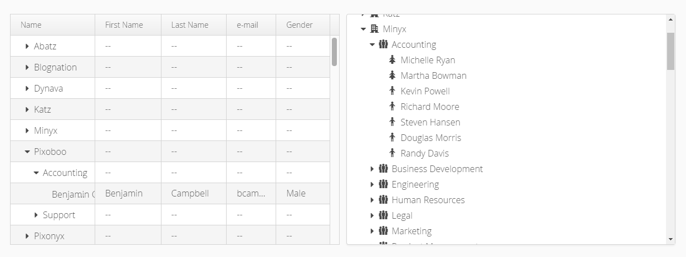

tree-database-example
==============

Example of using Vaadin [TreeGrid](https://vaadin.com/docs/-/part/framework/components/components-treegrid.html) and 
[Tree](https://vaadin.com/docs/-/part/framework/components/components-tree.html) on top of JDBC database connection.
[]

Workflow
========

To compile the entire project, run "mvn install".

To run the application, run "mvn jetty:run" and open http://localhost:8080/ .

To produce a deployable production mode WAR:
- run "mvn clean package"
- test the war file with "mvn jetty:run-war"

Using Vaadin pre-releases
-------------------------

If Vaadin pre-releases are not enabled by default, use the Maven parameter
"-P vaadin-prerelease" or change the activation default value of the profile in pom.xml .
